# I. Configuration and Setup

## 1. Setup Audit Trail

> Used to track any meta-data changes in the org

### *Highly-related Concepts:

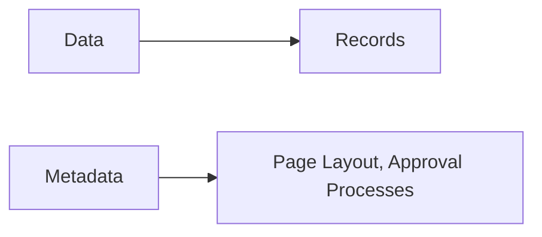

### Summary:

1. Track recent(top20 -- 6months) changes to the org
2. Use case: find any changes that may be causing issues

## 2. Fields and Formulas

### Lookup Field

> In Salesforce, a Lookup field is a type of field that establishes a relationship between two objects. It allows you to
> create a link or reference from one object to another. The Lookup field is used to establish a parent-child
> relationship
> between two objects, where the child object holds a reference to the parent object.

### Cross-Object Formula

> A Cross-object formula is a formula that spans two related objects and references merge fields on those objects. A
> cross-object formula can reference merge fields from a master (“parent”) object if an object is on the detail side of
> a
> master-detail relationship. A cross-object formula also works with lookup relationships.

### Summary:

| Lookup Field                            | Cross-Object Formula                                               |
|-----------------------------------------|--------------------------------------------------------------------|
| Relationship                            | Formula                                                            |
| Stores a reference to the parent record | Used to perform calculations or retrieve data from related objects |

### Lookup Relationship & Cross-Object Formula field

> A cross-object formula field can be created on opportunity object to display data from industry field on account
> object using account ID lookup relationship.

### Change Field Data Type & Delete Fields:

#### Change Field Data Type

- Custom Field Data type can be changed, standard fields cannot.
- May cause [data loss](https://help.salesforce.com/s/articleView?id=sf.notes_on_changing_custom_field_types.htm&type=5)
- Not every custom field type can be changed
- Not for Lead mapped fields

#### Delete Fields

- Standard fields cannot be deleted, only custom fields can
- Can’t delete a custom field that’s referenced by a field update or Apex.
- Can be restored
- 15 days in the recycle bin before permanent deletion
- Data restored when field restored
- Field history data can not be restored

## 3. Lightning App Builder

> Allow you to refine the appearance of org to make it easier and more accessible to users

### Page Configuration

> Can be used to configure the Lightning Record Page

- Page Structure
- Components
- Component Visibility
- Actions
- Dynamic Actions

### Feature

- Form factor
- Page analysis
- Assignment
- Org default
- App default
- App, record type, profile

### Pages to create:

| Page Type   | Description                                                        |
|-------------|--------------------------------------------------------------------|
| App Page    | Build one-page app for Lightning Experience and the **mobile app** |
| Home Page   | Customize the Lightning Experience Home Page                       |
| Record Page | Customize the Lightning Experience Record Page                     |

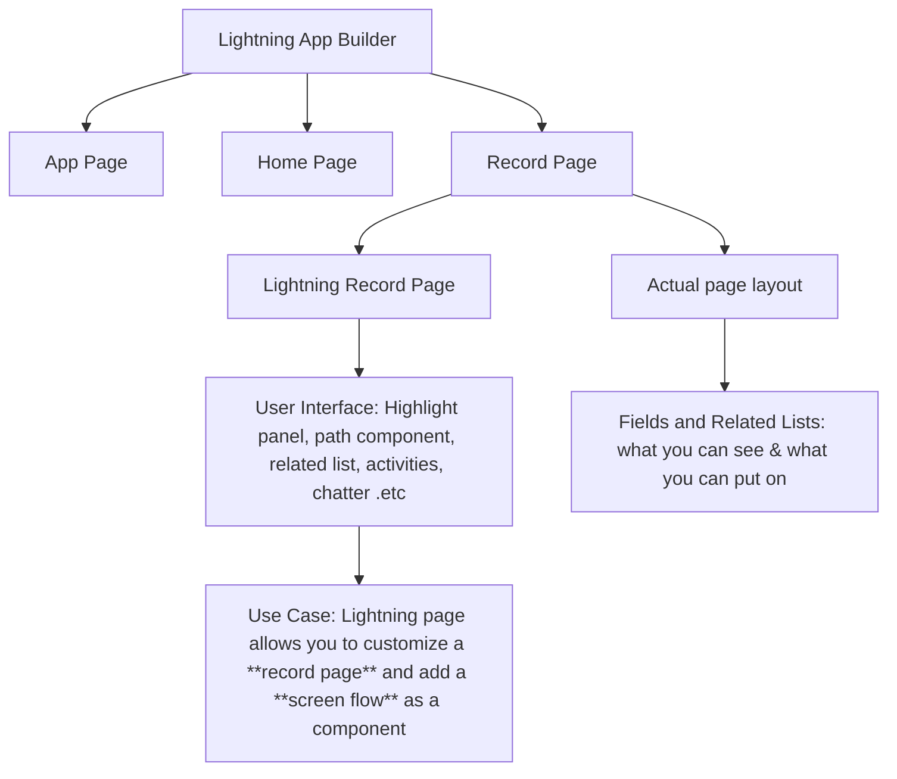

### Use case

- Manager wants to boost productivity by providing insights at the start of each day.
  Which three sales-specific standard Lightning components should administrator add to the homepage to meet this
  requirement?
    - Activities
    - Assistant
    - Key Deals

### Highly-related Concepts:

#### All about mobile

- App page & record page  are two types of pages that an administrator can build and customize
  using Lightning App Builder for Salesforce mobile app.
- Utility bar  is a feature which is available in lightning app when visibility is limited to
  SF **mobile app**
- In mobile navigation menu, Lightning app pages, Chatter, Dashboards are available
## 4. Profiles

> Define how users access objects and data, and what they can do within the application. When you create users, you
> assign a profile to each one.

- Standard Profiles cannot be edited
- Controller by **Record type assignment**, **Assigned apps**, **Security at the field-level**
- Login IP ranges

### Highly-related Concepts:

- **Object permissions** specify the type of access that users have to objects.

## 5. Permission Sets

> A collection of settings and permissions that give users access to various tools and functions. Permission sets *
*extend** users’ functional access without changing their profiles and are the recommended way to manage your users’
> permissions.

- config what users can do with **records**
- Component visibility allows you to restrict access to of a related list based on the permission set

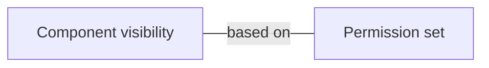

## 6. Login IP Range & Trusted IP Addresses

### Summary:

| Login IP Range                                                         | Trusted IP Addresses                                                                       |
|------------------------------------------------------------------------|--------------------------------------------------------------------------------------------|
| Profile level                                                          | Org level                                                                                  |
| Prevent users from logging in from the one isn't within Login IP Range | Doesn't prevent users from logging in from the one which out of the Trusted IP Addresses   |
|                                                                        | Login in from the Trusted IP Addresses, there is **no** verification check                 |
|                                                                        | Login in outside the Trusted IP Addresses, users are required to pass a verification check |

### Highly-related Concepts:

1. User Login via user interface

- Check authentication based on User's **profile** settings and **permissions**
    - Including **Login hours**, **Login IP Range**
    - Two-factor authentication

## 7. Omni-Channel

> Allows agents to work on multiple cases or chats based on availability, capacity, and skills.

## 8. Currency

> By default, Salesforce organizations use a single currency. Once you set the required currency locale in your company
> settings, all currency values on records display in that currency.

## 9. All about access

### Diagram:

> Start from the most restrictive level of access, and then grant additional access as needed.

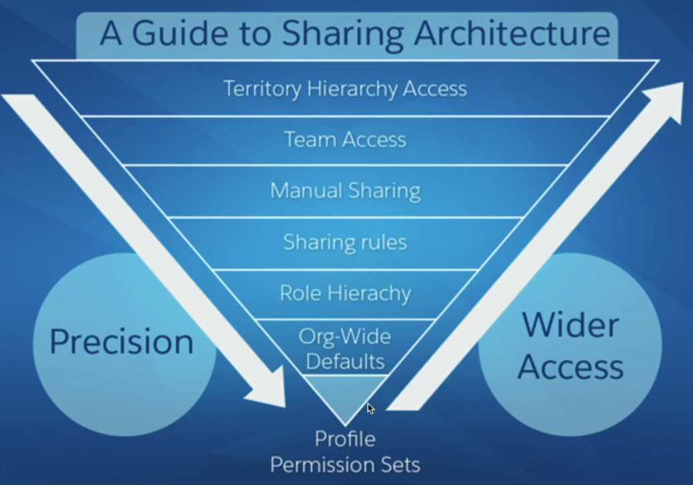

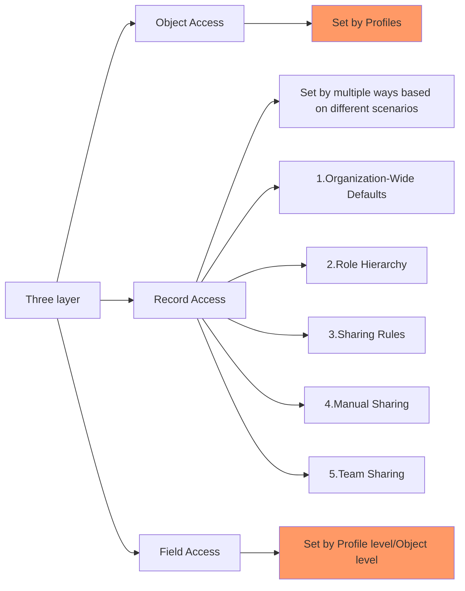

### 0. CRED Access

- Create
- Read
- Edit(same as update)
- Delete

### 1. Object Access

- **Tab setting** which controls object visibility
    - Hidden
    - Default On
    - Default Off
- Set object permission with CRED
    - Special permission: **View All**, **Modify All**
        - Users can view and read, edit, delete, transfer, and approve all records of that object, regardless of sharing
          settings.

### 2. Record Access

> Control which records users has access to and their level of access

**Notice:** User cannot gain access to a record even through sharing feature without the object
access

#### 2.1. Organization-Wide Defaults

- Set baseline record access for all users
- Various access levels including(Based on the object): Public Read/Write, Public Read Only,
  Private
- Record access can only be **opened up** by sharing rules, not **restricted**
- Org Wide Defaults do not override profile settings

#### 2.2. Role Hierarchy

> Make sure managers have access to the same records as their subordinates

#### 2.3. Sharing Rules

- Owner-Based Sharing Rules
- Criteria-Based Sharing Rules

#### 2.4. Manual Sharing

##### User case:

> When a user is deactivated, the role is removed and any manual sharing involving the user is deleted. If the user is
> reactivated, the role restored but the **manual sharing does not**.

#### 2.5. Team Sharing

### 3. Field Access/Field Level Security

> Control which fields users have access to and their level of access

#### 3.1. In Profiles

> Define every field with two checkboxes: Read access, Edit access

#### 3.2. In Object manager

> Select a single object, then select fields & relationship, choose a field(For different profiles) to edit: Visible,
> Read-Only

## 10. Security

- **Contact**, **Lead**, **Person Account** are three objects that have individual field
  available for tracking data privacy information when data protection is enabled.
- **Security Health Check** includes:
    - **Password Policies** used to enforce password complexity and expiration
    - **Session Settings** used to restrict access to Salesforce from specific IP addresses
    - **Remote Site Settings** used to restrict login access to Salesforce from specific
      hours of the day
- **Session** used to configure user session settings, such as session timeout, session
  security
  level

# II. Object Manager and Lighting App Builder

## 1. Relationships

> Used to link objects with other objects, allow users to relate records with each other.

### Types of Relationships:

- Lookup Relationship
- Master-Detail Relationship

### Summary:

| Master-Detail Relationship                                      | Lookup Relationship                    |
|-----------------------------------------------------------------|----------------------------------------|
| Tight                                                           | Loose                                  |
| One to One One to Many Many to Many via Junction Object | One to One One to Many             |
| Parent record always required                                   | Parent not required                    |
| Child record deleted when parent record deleted                 | Deletion removes value in lookup field |
| Roll-up summary fields possible                                 | No Roll-up summary fields              |
| Parent access controls child access                             | Independent security and sharing       |
| Standard object cannot be child                                 | Standard object can be on many side    |
| Max of 2/object                                                 | Max of 40/object                       |

## 2. Record Type

> Used to provide Users with different Picklist Values, Page Layouts and Business Process for an Object.

### Key Considerations:

- Picklist Values, Page Layouts, Business Process
- Page Layout Per Record Type Per Profile
- Objects can have multiple Record Types
- Record Type Access set by Profile

### Operation:

- create page layout
- create picklist value
- create process
- create record type
- select process
- assign profiles
- assign page layout

### Summary:

1. Allow Users to capture different info on Objects depending on the Record Type
2. Can be used to assign page layout, picklist value, and business process
3. Objects can have multiple Records Types
4. Profiles defined which Records Types Users can **create**
5. Users can see records when they don’t have access to the Records Type
6. Page Layouts can be set by **Records Type(of Objects)** by **Profile(of Users)**

### *Highly-related Concepts:

- Page Layout can be assigned based on Record Types and Profiles.
- Page Layout editor can customize related list on **detail** page by add or remove fields.
- ~~Business processes display different **picklist** values according to each user’s **profile** but do not assign
  records.~~

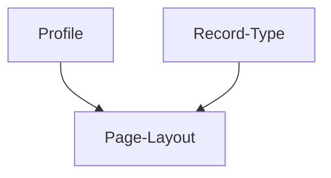

## 3. Business Processes

> Used to specify which Picklist values are available to Users based on the Record Type.

### Summary:

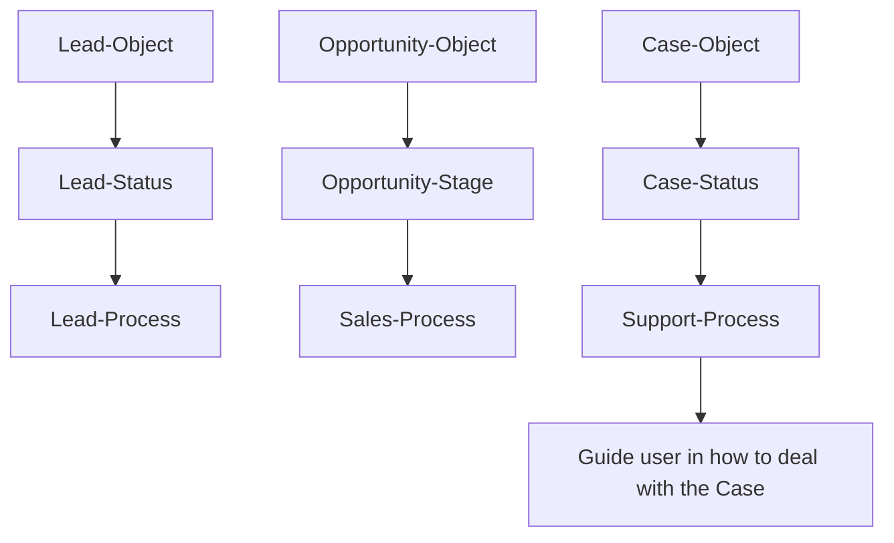

## 4. Path

> Guide Users visually

### Summary:

- Used to guide Users visually
- Available to most Objects(Not just business processes)
- Must be enabled in Setup
- Must be added to Lighting Record Page

### *Highly-related Concepts:

**Path Key Fields:**

- **Key fields**display in**Lightning Experience**as part of the Sales Path feature (not available in classic). To
  display Key Fields in Lightning Experience, we have to**Enable**the Sales Path. **Lead and Opportunity** object can
  have Key fields. You can include both**Standard**and**Custom fields**.

## 5. Object

### Types

- Standard Objects
    - include with SF by default, but also can be created by users
- Custom Objects
    - Custom objects automatically include some standard fields
        - CreatedById
        - Currency
        - Name
        - ....

# III. Sales and Marketing Applications

## 1. Campaigns

> Used to track marketing efforts(A standard object)

- Email Marketing
- Advertisements
- Events

### Summary:

- Used to track marketing efforts
- Need Marketing User Permission to create, edit, delete Campaigns
- Contains info like: Leads in Campaign, Converted Leads, value of won Opportunities
- Campaign Status field: standard picklist field
- Campaign Members - Leads or Contacts, can be Accounts if enabled

### *Highly-related Concepts:

**Campaign Members:**

- Leads and Contacts that are associated with a Campaign.

- Campaign Members status(custom picklist field) can be added up to 50 options.

- To customize Campaign Member Status picklist values by marketing users themselves, it needs:
    - A marketing user feature license
    - Edit permission for campaign

**Campaign Hierarchy:**

scenarios:

- In a festival sales activity, we can use a parent campaign to manage the child campaigns, so we can easily track all
  the marketing channels and compare the performance of each channel.

**Campaign Influence:**
> Used to track the impact of Campaigns

summary:

- Used to track and measure Campaign influence on Opportunities
- Prerequisite: CRM User Permission
- Campaign Influence 1.0: One Campaign is allocated all the Opportunity Amount
- Customizable Campaign Influence: Multiple Campaigns can be allocated the Opportunity Amount
- Campaign Influence can be auto associated to Campaigns

## 2. Territory Management

> Salesforce Territory Management allows territories to be defined through a set of rules. Classifying sales reps, sales
> managers, opportunities, and customers by territory, give another way to sort CRM data and gives executives a better
> picture of the business by area.

# IV. Service and Support Applications

## 1. Service Console

> Apps which are tab-based workspace for fast-paced work environment. Manage multiple records on single page.

# V. Productivity and Collaboration

## 1. AppExchange

> A collection of salesforce and third-party add ons

### Types of Solutions:

- Apps
- Bolt Solutions
- Flow Solutions
- Lighting Data
- Components

**Also, you can find an expert to help you with your Salesforce implementation**

### Summary:

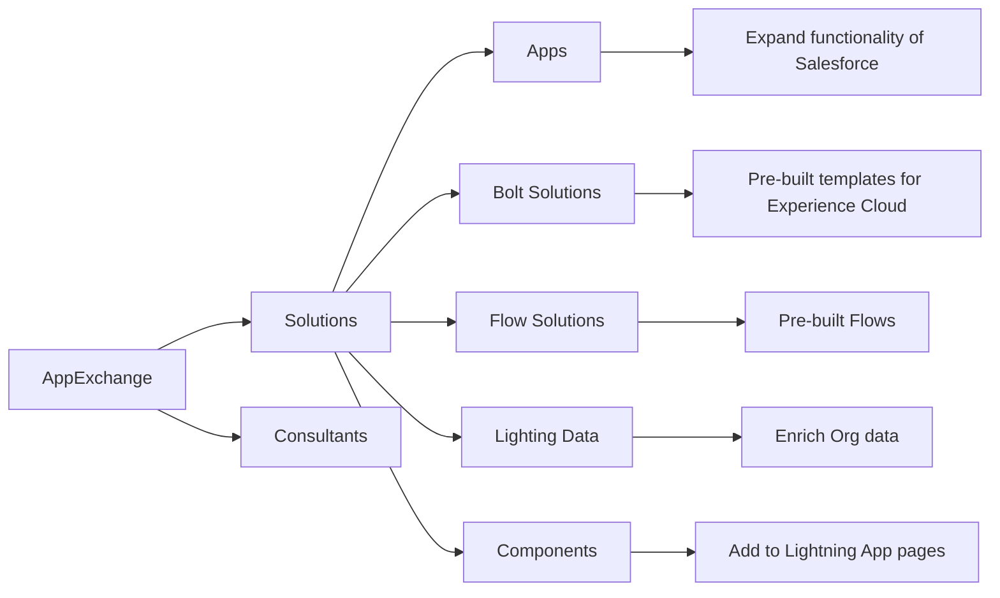

## 2. Chatter

> A collaboration tool that lets users share information and work together in real time

### 2.1. Pending Chatter Post

> It is a post that has been scheduled to be published at a future date and time

- **Use case**
    - A user who creates the pending post is deactivated before the scheduled time, the post will be canceled

# VI. Data and Analytics

## 1. All about Data

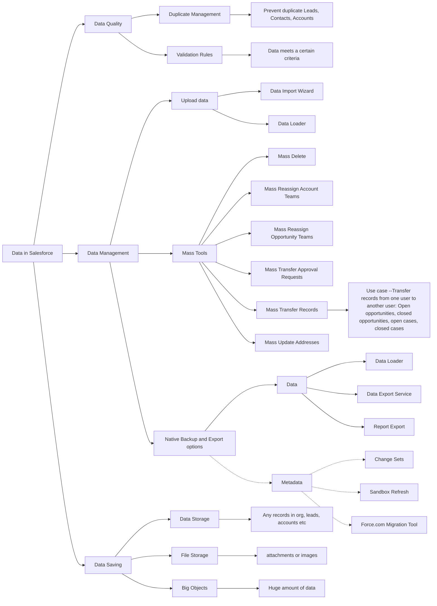

### A. Data Management

#### Data Import Wizard

- Only import Campaign Members, Leads, Solutions, Contacts, Accounts, Person Accounts and custom Objects
- 50000 records limit
- Insert, Update, Upsert
- Duplicate Checking
- Validation Rules and triggers fires
- Workflow rules can be turned off
- No download required
- Used by Admins and Users
- Only import CSV files

#### Data Loader

- All objects supported
- 5 million record limit
- Insert, Upsert, Delete, Hard Delete, Export
- No Duplicate Checking
- Validation Rules and workflow rules and triggers will fire
- Used by Admin only
- Download required, **not in App Exchange**

#### Mass Tools

- Carry out actions in mass
- Deleted records will store in recycle bin for 15 days

#### Data Export Service

- Images, documents, attachments, salesforce files, certain records
- Can be monthly or weekly export depending on edition
- Can be scheduled
- Should be run from production org
- Only export data, not **~~metadata~~**

#### Data Loader

- More regular exports using command line Interface

### B. Data Quality

#### Duplicate Management

> Used to prevent duplicate Leads, Contacts, Accounts.

#### Validation Rules

> Used to enforce data quality, data entered by users meets a certain criteria

Operations of creating validation rules:

- Name and Description
- The Rule(AKA. Error Condition Formula)
- The Error message(Include message location)

## 2. All about Report

### Types:

- Standard Report
- Custom Report

### Features:

1. **Conditional Formatting**
    - Has to be a summary field
    - Can not use it highlight fields on report without grouping
2. **Summary**
    - Row-Level formula
        - Captures data which isn't available in a field
        - Reference max 5 fields
        - Only **one** per report
    - Summary formula
        - Up to **five** per report
        - Only number, percent, currency can be used
    - Bucket Field
        - Create buckets for records with different values
        - Max 5 buckets field per report, the maximum number of buckets permitted is 20/Bucket Field.
        - Can be used in grouping(low, medium, high)
    - Summary Field
        - Sum, Average, Min, Max
3. **Report Formats**
    1. **Tabular**
        - Basic type, columns - fields & rows - records
        - No grouping, no chart
    2. **Summary**
        - Includes subtotals and grouping rows(Up to **3** levels of grouping)
        - Used for dashboard components
    3. **Matrix**
        - Group not just by rows but also by columns
        - Two levels of summarization, can use stacked chart
        - Used for analyzing or reporting on large amounts of data
    4. **Joined**

    - Used to view and analyze data from multiple report types
    - Up to **5** blocks(Up to 2000 records) showing data from standard or custom report types
4. **Report Snapshots**
    - Used to report on historical data and spot trends
    - Requires a creation of Custom Object
    - Choose what fields/data are captured
    - Schedule the frequency of the snapshot are taken
    - Use case:
        - Manager wants to see how the Opportunity Pipeline has changed over time
5. **Numbers to remember**
    - Max **4** as long as the objects have associations can be added to a custom report type

### Highly-related Concepts:

#### 1. Sharing model on reports

- Only show records that the user has access to
    - If two users run the same report, they may see different results
- Only access reports and dashboards that are in the folders they have access to
- Main factors:
    - Organization-wide defaults
    - Role hierarchy
    - Sharing rules
    - Manual sharing

#### 2. Comparison

| Row-Level formula                                                                                                                                                                                                                                     | Roll-Up Summary Field                                                                                                                                                                                                                                                                                                                                                     |
|-------------------------------------------------------------------------------------------------------------------------------------------------------------------------------------------------------------------------------------------------------|---------------------------------------------------------------------------------------------------------------------------------------------------------------------------------------------------------------------------------------------------------------------------------------------------------------------------------------------------------------------------|
| Calculates values based on the data within a single record.  It allows you to perform calculations using other fields' values within the same record.  It is typically used to derive values or perform calculations specific to each record. | A Roll-up summary field is a field that calculates values based on related records in a master-detail or lookup relationship.  It allows you to perform calculations on child records and display the aggregated result on the parent record.  Roll-up summary fields are typically used to summarize data from child records and display it at the parent level. |

## 2. All about Dashboard

> Made up of components that display data from source reports

#### 1. Sharing model on dashboards

- Sharing and visibility of dashboards is controlled by the same factors as reports

#### 2. View Dashboard As

- Me
- Another user
- The dashboard viewer(This is **Dynamic Dashboard**)

#### 3. Numbers to remember

- Max components that can be added to a single Dashboard: 15

# VII. Workflow/Process Automation

## 0. Order of Execution

- Validation Rules
- Assignment Rules
- Auto-Response Rules
- Workflow Rules
- Escalation Rules
- Processing

## 1. Workflow Rules

> Used to perform an action when certain conditions are met. Only one `if then` statement.

### Summary:

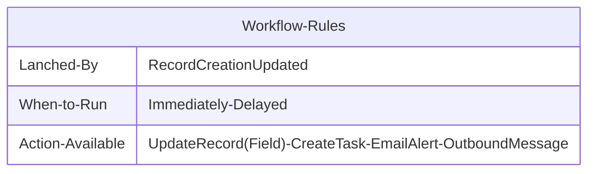

## 2. Approval Process

> Used to automate the approval of records in Salesforce.

### Initial submission actions

- The value of a field on the record can be updated
- An outbound message can be sent to another application

### Summary:

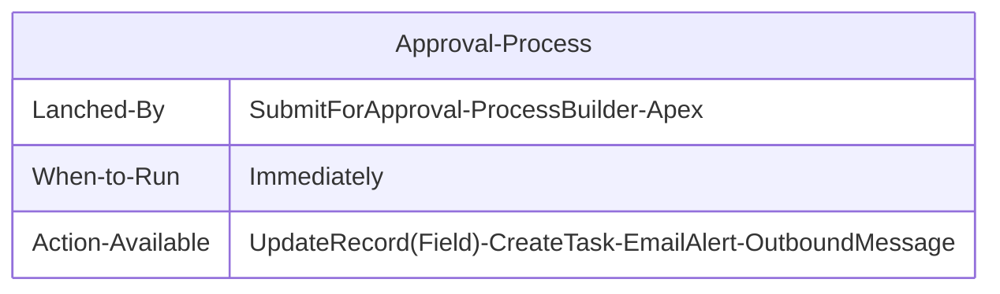

## 3. Process Builder

> Made up of multiple `if then` statements with UI interface, **can not send Outbound Message**.

### Summary:

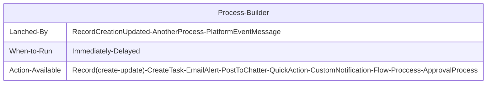

## 4. Flows

> King of declarative tools with ability to state **complex logic**.

### Summary:

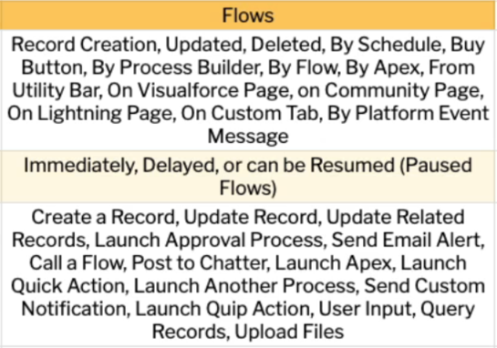

### Types of Flows:

- Screen Flow
- Schedule-Triggered Flow
- Auto-launched Flow(No Trigger)
- Record-Triggered Flow
    - Involve two `types`
        - Fast Field Updates(AKA.Before-Save Flow)
            - Support: Assignment, Decision, Loop, Get Records
        - Actions and Related Records(AKA.After-Save Flow)
- Platform Event-Triggered Flow

## Highly-related Concepts:

TODO: Add more details
Link：
https://help.salesforce.com/s/articleView?id=sf.actions_overview.htm&type=5
https://thoughtworks.udemy.com/course/pass-the-salesforce-admin-certification-2022/learn/lecture/32297690#notes
Task and Quick Actions

**1. Frequency of execution**

> Recurring Task is task that repeat at a regular interval, such as daily, weekly, monthly, etc

**2. External connect**

> Quick action allows you initiate expense reports form SF to an external system

## 5. Summary

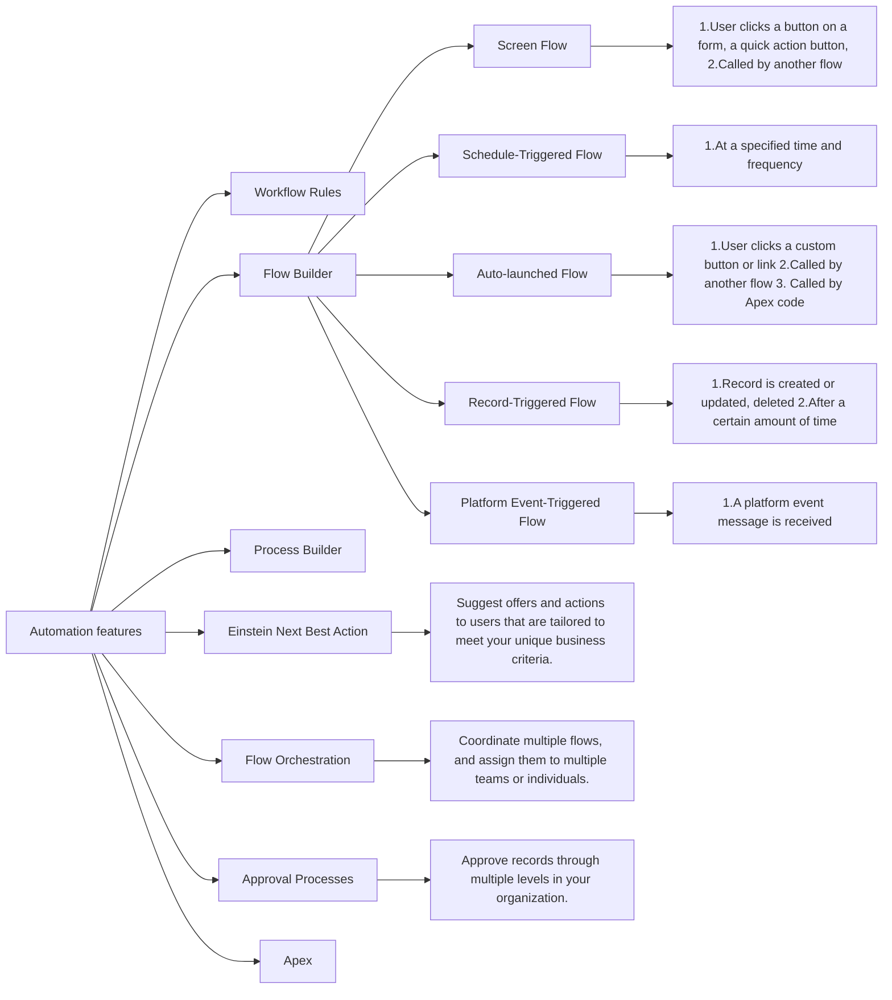

# All the Rules

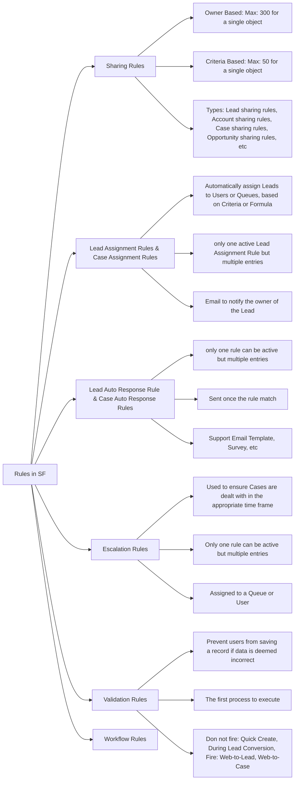