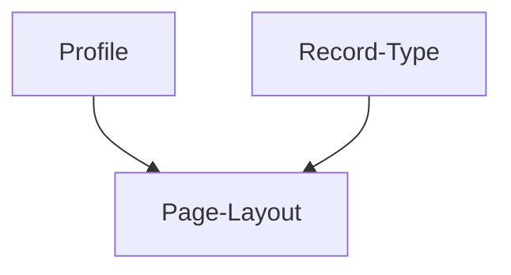
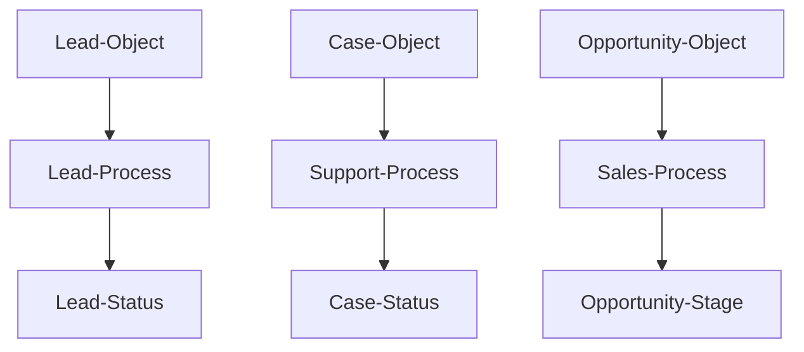
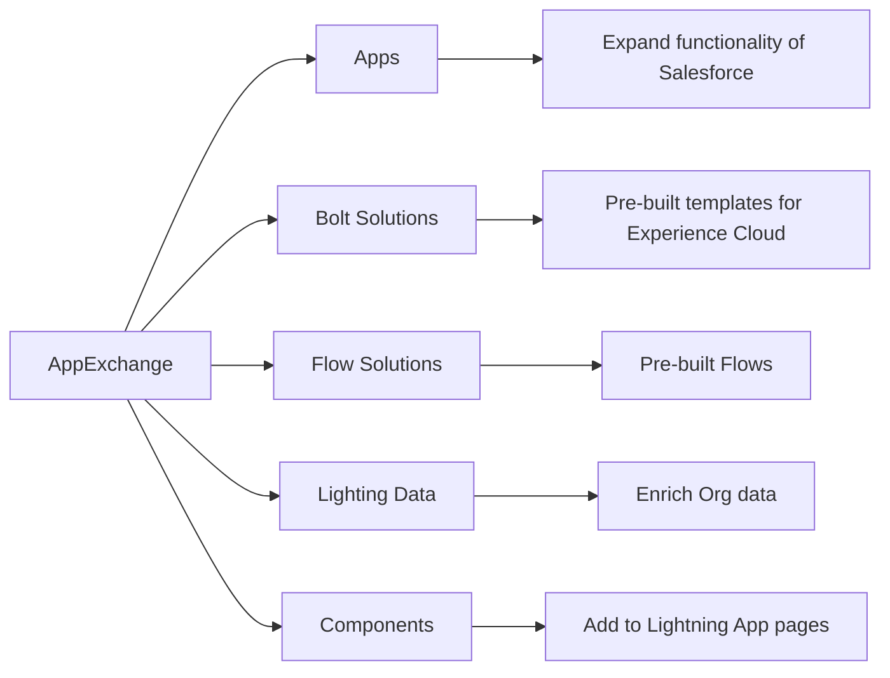
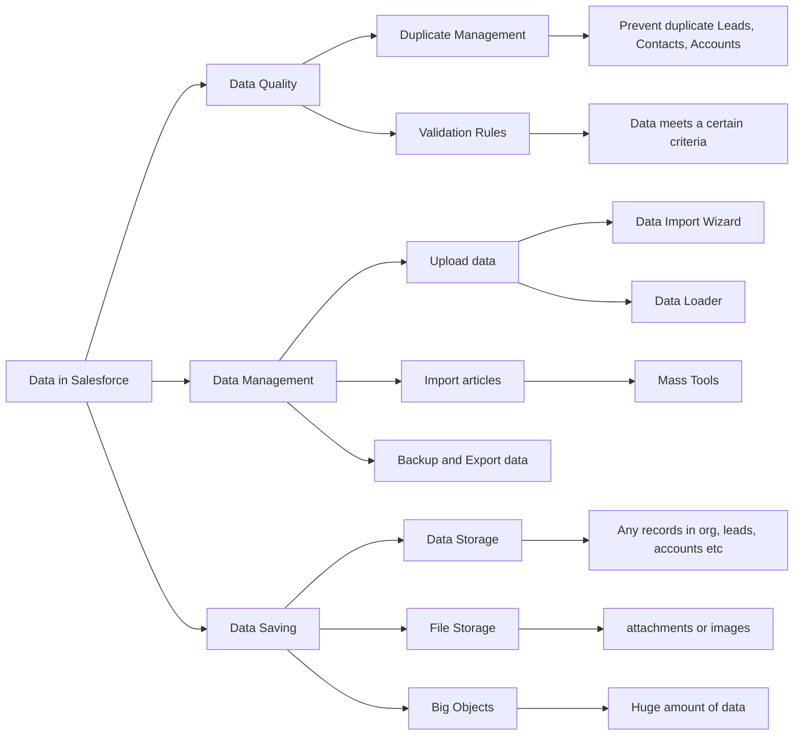

# Object Manager and Lighting App Builder

## Relationships

## Record Type
> Used to provide Users with different Picklist Values, Page Layouts and Business Process for an Object.

### Key Considerations:
- Picklist Values, Page Layouts, Business Process
- Page Layout Per Record Type Per Profile
- Objects can have multiple Record Types
- Record Type Access set by Profile

### Operation:
- create page layout
- create picklist value
- create process
- create record type
- select process
- assign profiles
- assign page layout

### Summary:
1. Allow Users to capture different info on Objects depending on the Record Type
2. Can be used to assign page layout, picklist value, and business process
3. Objects can have multiple Records Types
4. Profiles defined which Records Types Users can **create**
5. Users can see records when they don’t have access to the Records Type
6. Page Layouts can be set by **Records Type(of Objects)** by **Profile(of Users)**

### *Highly-related Concepts:

Page Layout can be assigned based on Record Types and Profiles.

## Business Processes
> Used to specify which Picklist values are available to Users based on the Record Type.

### Summary:

## Path

>Guide Users visually

### Summary:
- Used to guide Users visually
- Available to most Objects(Not just business processes)
- Must be enabled in Setup
- Must be added to Lighting Record Page

### *Highly-related Concepts:

**Path Key Fields:**

- **Key fields** display in **Lightning Experience** as part of the Sales Path feature (not available in classic).
   To display Key Fields in Lightning Experience, we have to **Enable** the Sales Path.  **Lead and Opportunity** object can have Key fields. You can include both **Standard** and **Custom fields**.

# Sales and Marketing Applications

## Campaigns
> Used to track marketing efforts(A standard object)

- Email Marketing
- Advertisements
- Events

### Summary:
- Used to track marketing efforts
- Marketing User Permission(create, edit, delete Campaigns)
- Contains info like: Leads in Campaign, Converted Leads, value of won Opportunities
- Campaign Members - Leads or Contacts, can be Accounts if enabled

### *Highly-related Concepts:

**Campaign Members:**

- Leads and Contacts that are associated with a Campaign. 

- Campaign Members status can be added up to 50 options.

**Campaign Hierarchy:**

scenarios:

- In a festival sales activity, we can use a parent campaign to manage the child campaigns, so we can easily track all the marketing channels and compare the performance of each channel.

**Campaign Influence:**
> Used to track the impact of Campaigns

summary:
- Used to track and measure Campaign influence on Opportunities
- Prequisites: CRM User Permission
- Campaign Influence 1.0: One Campaign is allocated all the Opportunity Amount
- Customizable Campaign Influence: Multiple Campaigns can be allocated the Opportunity Amount
- Campaign Influence can be auto associated to Campaigns

# Productivity and Collaboration

## AppExchange
> A collection of salesforce and third-party add ons

### Types of Solutions:

- Apps
- Bolt Solutions
- Flow Solutions
- Lighting Data
- Components

### Summary:

# Data and Analytics 

## All about Data

### Data Management

#### Data Import Wizard 

- Only import Campaign Members, Leads, Solutions, Contacts, Accounts, Person Accounts and custom Objects
- 50000 records limit
- Insert, Update, Upsert
- Duplicate Checking
- Validation Rules and triggers fires
- Workflow rules can be turned off
- No download required
- Used by Admins and Users
- Only import CSV files

#### Data Loader

- All objects supported
- 5 million record limit
- Insert, Upsert, Delete, 

### Data Quality

#### Duplicate Management
> Used to prevent duplicate Leads, Contacts, Accounts.
#### Validation Rules
> Used to enforce data quality, data entered by users meets a certain criteria